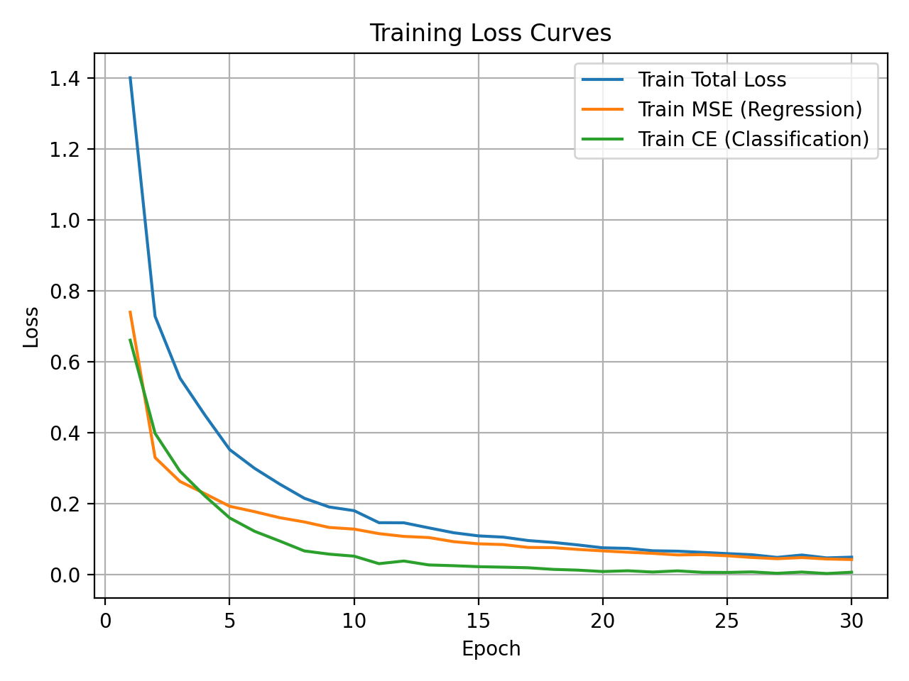
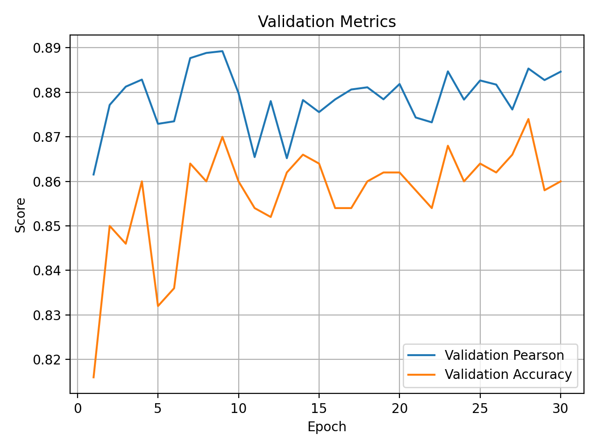
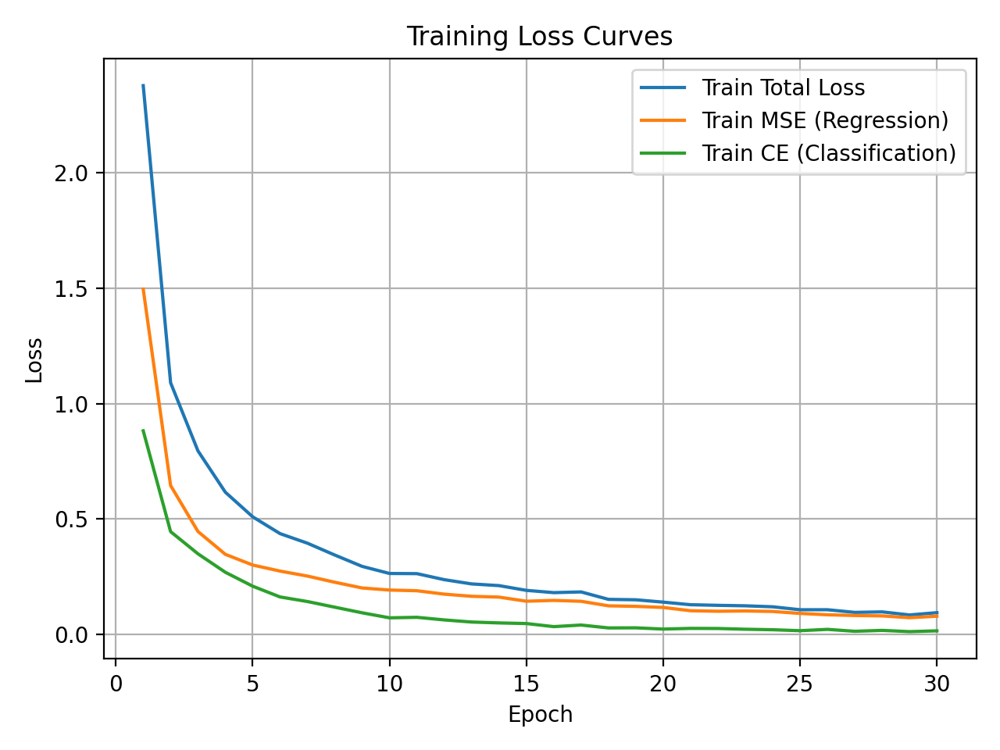
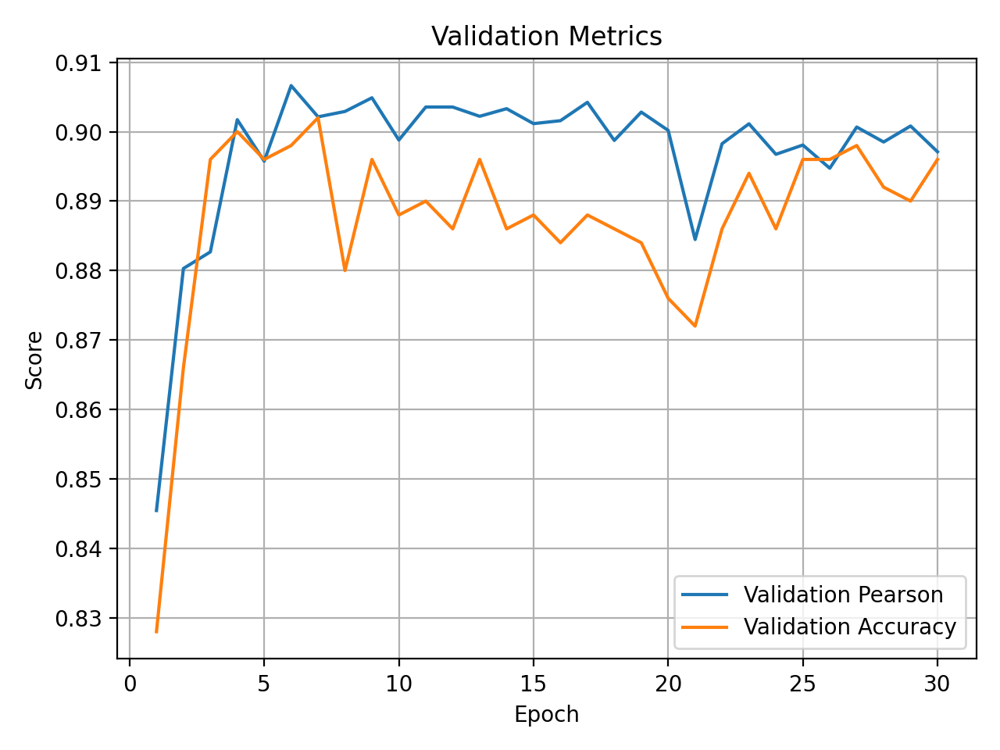
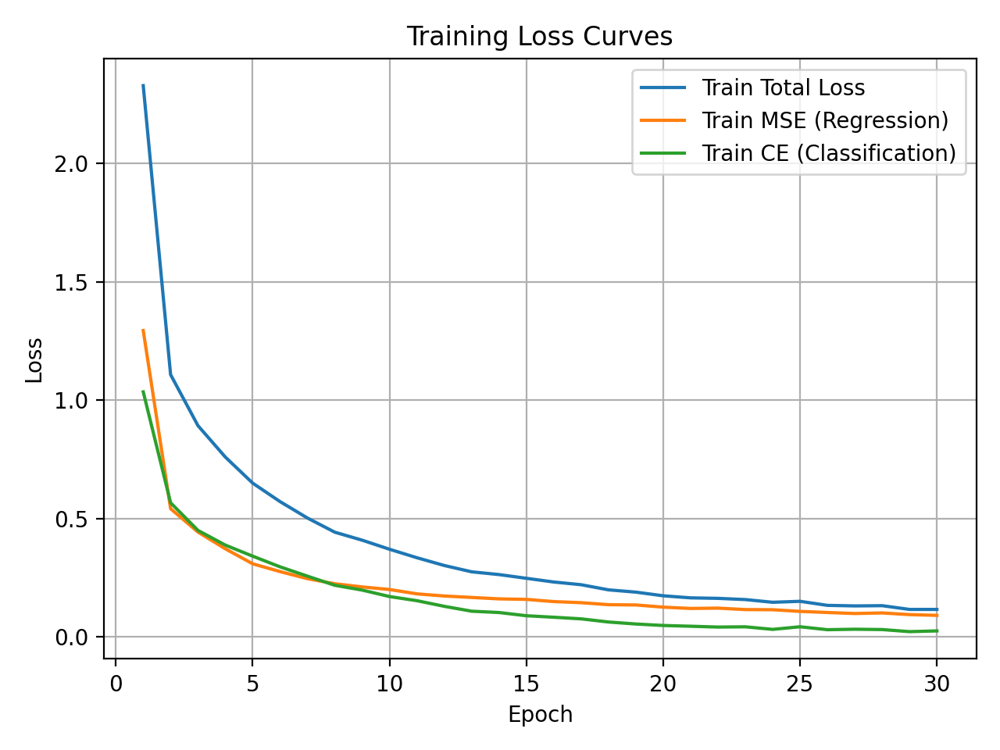
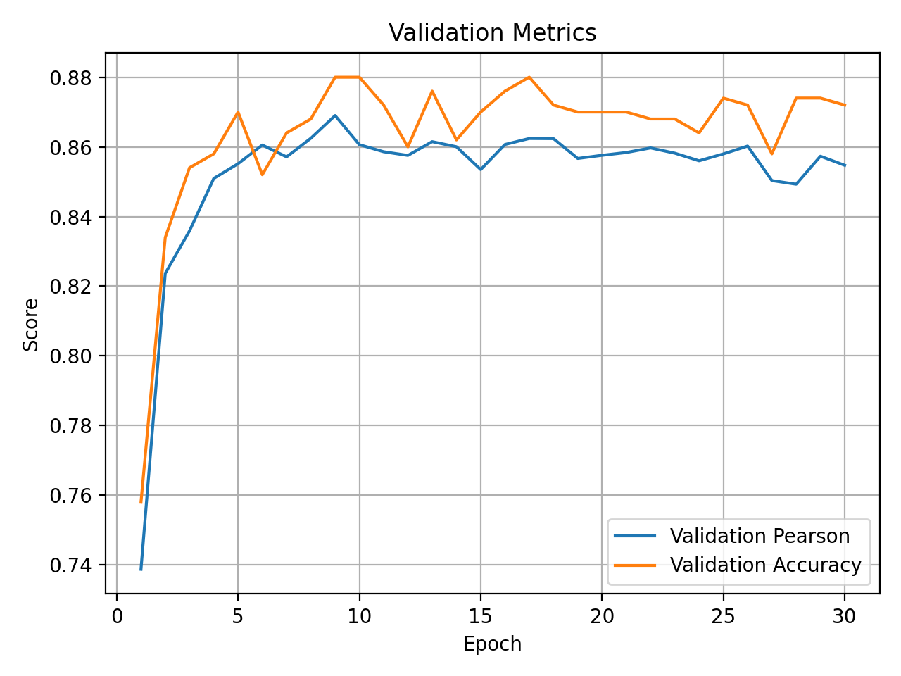

# NLP-Multi-output-Learning
此為清大自然語言處理課程的 HW3: will practice building a BERT-based model for multi-output learning

# 🧠 NLP Homework 3 — Multi-Output Sentence Understanding

**Name:** 翁智宏  
**Student ID:** 313707043  
**Institution:** 國立陽明交通大學 資訊管理與財務金融研究所  
**Course:** Deep Learning for Intelligent Agents  
**Date:** 2025/11  

---

## 📘 Overview

This homework focuses on **multi-output learning** using the **SICK (SemEval 2014 Task 1)** dataset.  
The model simultaneously performs:

- **Regression:** Predicting the semantic relatedness score (0–5)  
- **Classification:** Predicting the entailment relation (*Entailment / Neutral / Contradiction*)

We compare different Transformer architectures and training strategies:

- BERT-base (multi-output)
- RoBERTa-base (multi-output)
- GPT-2 (multi-output)
- Single-task BERT (regression-only / classification-only)
- Multi-output BERT (joint learning)

---

## ⚙️ Experimental Settings

```python
lr = 2e-5
epochs = 30
train_batch_size = 32
validation_batch_size = 32
max_length = 256
dropout = 0.2
```

---

## 📊 Quantitative Results

| Model | Pearson (Regression) | Accuracy (Classification) | Notes |
|:------|:--------------------:|:--------------------------:|:------|
| **BERT-base (multi-output)** | 0.8903 | 0.8750 | Baseline joint model |
| **RoBERTa-base (multi-output)** | 0.9033 | 0.8924 | Better pretraining and dynamic masking |
| **GPT-2 (multi-output)** | 0.8635 | 0.8731 | Decoder-only, weaker in reasoning |
| **Multi-task BERT (ours)** | **0.9126** | **0.8973** | Best joint learning model |
| **BERT (single-task regression)** | 0.9021 | — | Fine-tuned only for relatedness |
| **BERT (single-task classification)** | — | 0.8973 | Fine-tuned only for entailment |

---

## 📈 Training & Validation Curves

### 🟦 BERT-base

| Training Loss | Validation Metrics |
|:--------------:|:------------------:|
|  |  |

---

### 🟩 RoBERTa-base

| Training Loss | Validation Metrics |
|:--------------:|:------------------:|
|  |  |

---

### 🟥 GPT-2

| Training Loss | Validation Metrics |
|:--------------:|:------------------:|
|  |  |

---

## 🧩 1. BERT vs RoBERTa

**Main Differences:**
- RoBERTa removes **Next Sentence Prediction (NSP)** task.
- Uses **dynamic masking** during pretraining instead of static masking.
- Trained with **more data** and **larger batch sizes**.
- Applies **longer training schedule** for better convergence.

**Effect:**  
RoBERTa achieves higher Pearson (+2%) and Accuracy (+3%),  
indicating more stable optimization and better semantic generalization.

---

## 🧠 2. BERT vs GPT-2

| Aspect | BERT | GPT-2 |
|:-------|:-----|:------|
| Architecture | Encoder (Bidirectional) | Decoder (Autoregressive) |
| Pretraining Objective | Masked LM (MLM) | Causal LM (CLM) |
| Context Direction | Both left & right | Left-to-right |
| Task Orientation | Understanding | Generation |

**Analysis:**  
BERT, being bidirectional, captures both sides of the context and is ideal for sentence-pair reasoning tasks.  
GPT-2, however, predicts only in a left-to-right manner, which limits its understanding of symmetric sentence relations.  
As a result, GPT-2 performs slightly worse in tasks requiring precise semantic comparison.

---

## 🔀 3. Multi-Output vs Single-Task BERT

| Model | Pearson (Reg) | Accuracy (Cls) |
|:------|:---------------:|:---------------:|
| Single-task Regression | 0.9021 | — |
| Single-task Classification | — | 0.8973 |
| **Multi-output BERT** | **0.9126** | **0.8973** |

**Observation:**
- Multi-output learning provides a small but consistent improvement in both subtasks.  
- The model benefits from **shared representation learning**, where both regression and classification contribute to richer semantic understanding.  
- The regression head acts as a regularizer for the classification head, preventing overfitting.

🗣️ *Simplified summary:*  
> Learning both “how similar” and “whether they entail” helps the model build stronger semantic representations.

---

## 🧪 4. Error Analysis and Model Improvement

### **(1) Data-Level Issues**
- **Ambiguity:** Sentences with near-identical wording but different temporal or logical meaning.  
- **Label Noise:** Inconsistency between *neutral* and *entailment* examples.  
- **Imbalanced Data:** Overrepresentation of *entailment* class.

**Solutions:**
- Apply data augmentation (paraphrasing, tense transformation).  
- Rebalance dataset via oversampling.  
- Use hard example mining to refine borderline samples.

---

### **(2) Model-Level Issues**
- **Loss Interference:** Gradients from regression and classification may conflict.  
- **Encoder Limitations:** 512-token limit and insufficient context awareness.

**Solutions:**
- Adopt **DeBERTa** or **RoBERTa** for stronger context modeling.  
- Introduce **adaptive loss weighting** to balance task importance.  
- Use **contrastive learning** or **semantic consistency regularization**.

---

### **(3) Training-Level Issues**
- **Overfitting:** Model converges too quickly and memorizes frequent sentence patterns.  
- **Learning Rate Sensitivity:** Too high causes instability; too low slows convergence.  
- **Insufficient Dropout:** Low dropout can lead to poor generalization.

**Solutions:**
- Early stopping and cosine learning rate schedule.  
- Use mixed precision training (AMP) for efficiency.  
- Increase dropout to 0.3–0.5 for better regularization.  
- Apply layer-wise learning rate decay for stability.

---

## 📈 5. Visualization of Training Dynamics

| Model | Training Loss | Validation Metrics |
|:------|:---------------:|:------------------:|
| BERT-base |  |  |
| RoBERTa-base |  |  |
| GPT-2 |  |  |

---

## 🔬 6. Further Work to Strengthen the Report

1. **Error Visualization:** Display misclassified or low-correlation samples to understand model failure.  
2. **Ablation Study:** Compare multi-output vs single-output variants explicitly.  
3. **Model Comparison:** Evaluate alternative backbones (ALBERT, DistilBERT, DeBERTa).  
4. **Confidence Calibration:** Analyze prediction probabilities and uncertainty.  
5. **Enhanced Visualization:** Add confusion matrix and per-class accuracy charts.

---

## 🧰 Environment & Dependencies

```txt
torch
transformers
datasets
evaluate
tqdm
matplotlib
```

To reproduce:
```bash
pip install -r requirements.txt
python main.py
```

---

## 🏁 Summary

> In this project, we explored multi-output learning for sentence-pair understanding using BERT, RoBERTa, and GPT-2.  
> Experimental results show that **multi-task learning improves both Pearson correlation and classification accuracy**,  
> mainly due to shared semantic representation and regularization effects between the two subtasks.  
> Among all models, **RoBERTa** and **multi-task BERT** achieve the best overall performance.

---

📌 **Author:** 翁智宏  
📍 **Institute of Information Management & Finance, NYCU**  
📅 **November 2025**
